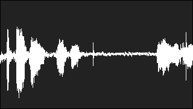

# PySoundGen

Python script to generate sounds and music from (descriptions of) sound waves.

[Sample music produced by PySoundGen](#sample-music)

Waveform formula from ["wavfile: A Simple Sound Library", written for CSE 20211 course, by Douglas Thain](https://www3.nd.edu/~dthain/courses/cse20211/fall2013/wavfile/).

    amplitude_at_sample_N = tone_amplitude_max * sin(2 * PI * frequency * (N/sample_rate))

License: MIT

## Dependencies

  - Python 3
  - To use the `--play`  option, `aplay` is needed. This should be installed by default in most Linux distros.

## Usage

PySoundGen takes a file (`tones_file`) describing the sound wave, and a filename for the output audio file (`output_wav_file`). Optionally plays
the output audio (`--play` option).

    $ ./soundgen.py {tones_file} {output_wav_file} [--play]

`tones_file` is a newline-separated file of space-separated triplets of `(duration, frequency, amplitude%)`. This describes the sound wave.

For example, a file, say `tones.txt`, with:

    4 44 100
	6 440 100
	2 440 50

describes a sound wave of 4 seconds of 44 Hz waves at 100% amplitude, then 6s of 440 Hz at 100%, then 2s of 440 Hz at 50%.

To generate sound from the above `tones.txt` file,

    $ ./soundgen.py tones.txt output.wav --play

will generate a wav file `output.wav` with audio as described above, and will play `output.wav`.

Wav file produced by above command: [`sample/example.wav`](./sample/example.wav?raw=true)

**NOTE:** The maximum amplitude of a sound card is `32767`. The `amplitude%` value taken is a percentage of this.

**NOTE:** Values `duration` and `frequency` can be decimals.

**NOTE:** Comments can be used in `tones_file` with `#`.

## Sample Music

The following generates the Sa-Re-Ga-Ma-Pa-Dha-Ni-Sa2-Sa2-Ni-Dha-Pa-Ma-Ga-Re-Sa tone from Indian Classical Music:

    $ cat saregama.txt
	2 240 100  # Sa
	2 270 100  # Re
	2 300 100  # Ga
	2 320 100  # Ma
	2 360 100  # Pa
	2 400 100  # Dha
	2 450 100  # Ni
	2 480 100  # Sa2
	0.5 480 0  # Silence
	2 480 100  # Sa2
	2 450 100  # Ni
	2 400 100  # Dha
	2 360 100  # Pa
	2 320 100  # Ma
	2 300 100  # Ga
	2 270 100  # Re
	2 240 100  # Sa

    $ ./soundgen.py saregama.txt saregama.wav

Wav file: [`sample/saregama.wav`](./sample/saregama.wav?raw=true)

Tones file: [`sample/saregama.txt`](./sample/saregama.txt)

